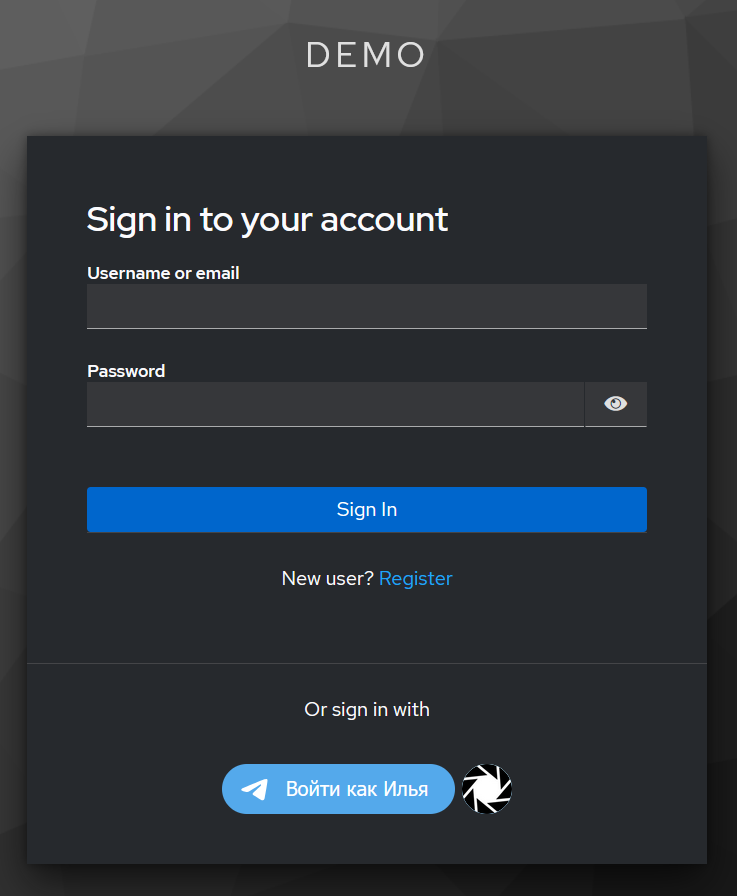
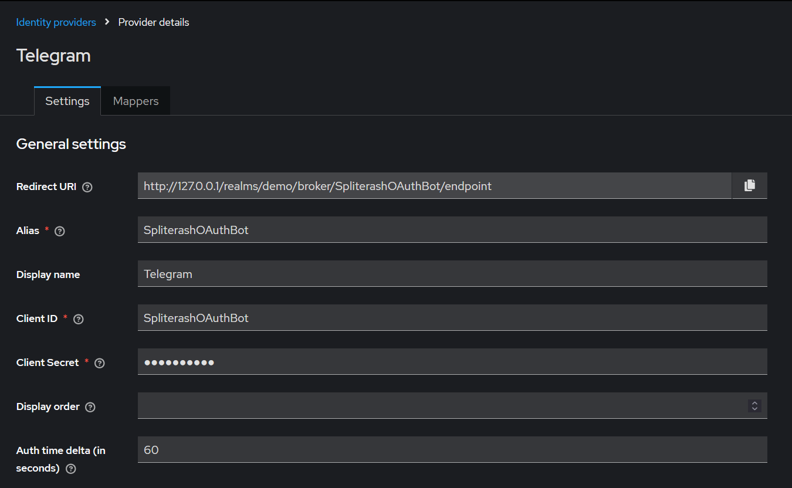

# Telegram Widget Identity Provider

The project allows you to add telegram as an identity provider to the keycloak

## Setup

1) Set `frame-src 'self' https://oauth.telegram.org/; frame-ancestors 'self' https://oauth.telegram.org/; object-src 'none';` in Realm `Content-Security-Policy` on `Security Defenses` tab
2) Select `keycloak.v2-telegram-web-login` theme
3) Add telegram identity provider.
   * <b>Specify alias</b> like your bot username, it's important. If you are making your own theme, you can skip this step, and set the value of your bot directly to the theme
   * Paste bot token at client secret
   * ClientID ignored, but required on frontend, so you can paste any stuff you want
     
4) Done, now you can register and log in via telegram

PS: I do not override account theme, because i don't need it, and actually don't know how. Button available only on login page

This project is a hard fork of https://github.com/rickispp/telegram-web-keycloak-authenticator
